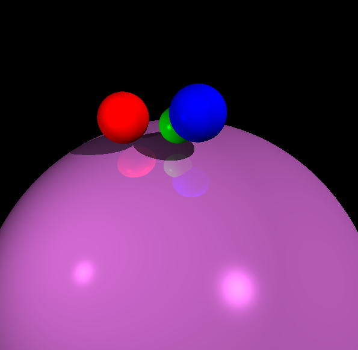

# Raytracing-from-scratch

Exploring the the technique of raytracing spheres using the DrawPixel() in C++.

Fully Implemented following functionalities:
- Camera view port (WIDTH, HEIGHT, POSITION, ROTATION)
- Directional, Ambient and Point lights
- Shadows
- Reflections
- Quaternion Rotations

All the functionalities were developed from scratch to understand the process behind game engine development.

